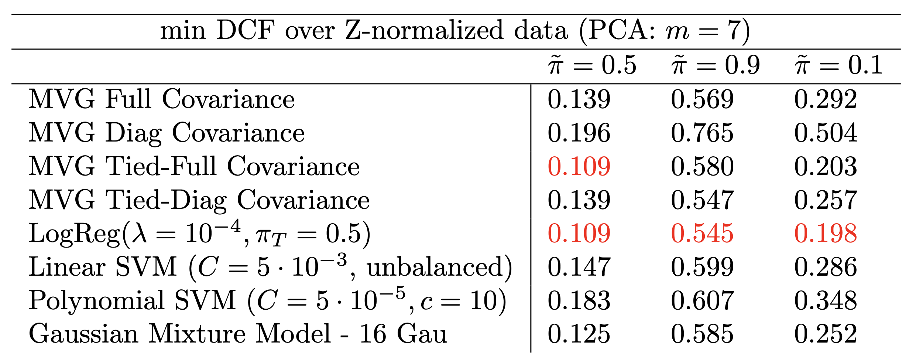
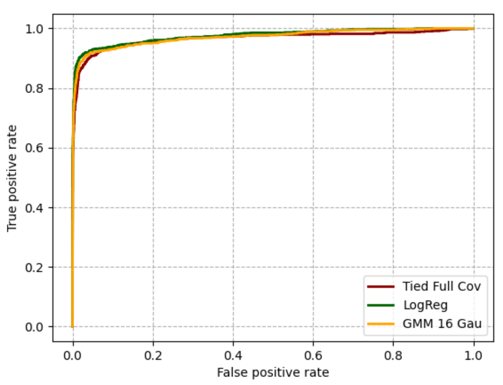

# Pulsar Signal Classification via Machine Learning

## Overview
Pulsars are a type of Neutron star that emit radio frequencies at regular intervals during their early formation phases. These signals are detectable from Earth using large radio telescopes. The challenge in finding pulsars is distinguishing their periodic radio signals from the vast majority of signals generated by radio interference. This project explores various Machine Learning approaches to classify signals in the HTRU2 dataset, focusing on enhancing the accuracy of pulsar detection.

## Methods
We employed several linear models to classify pulsar signals. The models included:
- **Linear Logistic Regression**
- **Multivariate Gaussian (MVG) Tied with Full Covariance**
- **Gaussian Mixture Model (GMM)** with sixteen components

Extensive data preparation was conducted, followed by the implementation of these models. The performance of the best models was evaluated by training on the entire training set and testing them on the entire test set.

## Results
The following table showcases the comparative results of our models:

### Key Findings:
- The **Linear Logistic Regression** model with regularization parameter λ = 10−4 and calibrated with πT = 0.5 was found to be the most effective and versatile, yielding the best scores across all applications.
- The **Multivariate Gaussian** model with tied full covariance matrices was as effective as logistic regression for the main application.
- The **Gaussian Mixture Model** followed in terms of effectiveness for the main application.

### ROC Curve Analysis
The ROC curve below illustrates the performance of all three models on the test set. As evident, the models perform similarly, with Logistic Regression having a slightly higher AUC, thus indicating better overall performance.

### Decision Cost Function (Min DCF)
The Decision Cost Function (DCF) is a metric used to evaluate the cost of decisions made by classification models based on predetermined costs for false positives and false negatives. It is particularly useful in scenarios where different types of errors have significantly different consequences.

The Logistic Regression model achieved a min DCF of 0.109, indicating high efficacy for balanced applications. However, the effectiveness decreases for unbalanced applications. This performance is consistent with results obtained from both single-fold and 5-fold cross-validation, suggesting that the training set choices were representative of the final test set outcomes.

## Conclusion
This study demonstrates the potential of machine learning in improving pulsar detection through effective signal classification. The Logistic Regression model, in particular, stood out in terms of versatility and accuracy.
